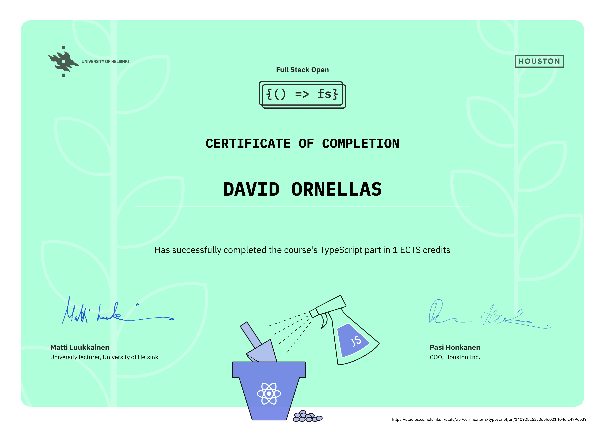

# Excercise solutions for [Full Stack Open 2022](https://fullstackopen.com/en/)

  
  
  
  

## Content

### Part 0 - [Fundamentals of Web Apps](https://github.com/Ornellasd/full_stack_open/tree/master/part0)

### Part 1 - [Introduction to React](https://github.com/Ornellasd/full_stack_open/tree/master/part1)

### Part 2 - [Communicating with server](https://github.com/Ornellasd/full_stack_open/tree/master/part2)

### Part 3 - [Programming a server with NodeJS and Express](https://github.com/Ornellasd/phonebook_backend)

### Part 4 - [Testing Express servers, user administration](https://github.com/Ornellasd/full_stack_open/tree/master/part4)

### Part 5 - [Testing React apps](https://github.com/Ornellasd/bloglist_fullstack)

### Part 6 - [State management with Redux](https://github.com/Ornellasd/full_stack_open/tree/master/part6)

### Part 7 - [React router, custom hooks, styling app with CSS and webpack](https://github.com/Ornellasd/full_stack_open/tree/master/part7)

### Part 8 - [GraphQL](https://github.com/Ornellasd/full_stack_open/tree/master/part8)

### Part 9 - [TypeScript](https://github.com/Ornellasd/full_stack_open/tree/master/part9)

### Part 10 - [React Native](https://github.com/Ornellasd/rate-repository-app)

### Part 11 - [CI/CD](https://github.com/Ornellasd/full-stack-open-pokedex)

### Part 12 - [Containers](https://github.com/Ornellasd/fso-part12-containers-applications)

